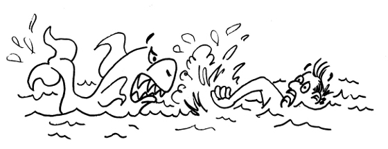
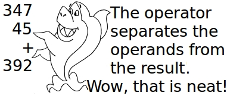

# Exceptions
```Nim
# nim c -d:release -o:xrd.x rd.nim

import os, strutils, sequtils, sugar
proc main() =
  proc avg(xs: seq[string]): float=
     var sm, n = 0.0
     for i, x in xs:
       try:
          sm = sm + x.strip.parseFloat
          n= n + 1.0
       except: discard
       finally: result= sm/n

  if paramCount() < 1: quit("Usage: " & paramStr(0) & " filename")
  let xs = readFile(paramStr(1)).split(Whitespace+{','})
  echo avg(xs)

main()
```

You will find `exceptions` in many languages, therefore I
believe that the above program will not pose difficulties.
The `avg` procedure does not try to eliminate invalid strings
from the sequence. Since the program is not sure that the
string represents a valid floating point number, it tries
to parse it. If the `avg` procedure fails to parse a string,
the error is captured in an exception section and immediately
discarded. Let us compile and test it:

```
› nim c -o:excrd.x -d:release --nimcache:del --hints:off excrd.nim

~/nim/tutorial/src
› ./excrd.x csv.data
138.75
```

\pagebreak
I defined the `avg` procedure inside the `main` procedure,
just to demonstrate that this is possible. The procedure `strip`
eliminates blanks surrounding the string, before parsing it to
floating point numbers. This is not strictly necessary, but
I did it just to be on the safe side.

## Ready
If you installed Nim and tested the programs on the previous
pages of this tutorial, you are ready for action. Listing @rpn
shows an implementation of an rpn calculator.



```Nim
# nim c -d:release -o:rpn.x --nimcache:lixo rpn.nim
import os, strutils
type LL= ref object of RootObj
    car: float
    cdr: LL

template car(a:untyped) : untyped=
  if a == nil: quit("Empty stack")
  else: a.car
template `>>` (a,b:untyped): untyped= LL(car: a, cdr: b)

proc eval(x: string, s: var LL)=
  try: s= x.strip.parseFloat >> s
  except:
    case  x:
      of "+": s= (car s) + (car s.cdr) >> s.cdr.cdr
      of "x": s= (car s) * (car s.cdr) >> s.cdr.cdr
      of "/": s= (car s.cdr) / (car s) >> s.cdr.cdr
      of "-": s= (car s.cdr) - (car s) >> s.cdr.cdr
      of "neg": s= -(car s) >> s.cdr
      else: quit("Error in eval")

var stk: LL = nil
for i in 1 .. paramCount(): eval(paramStr(i), stk)
while stk != nil:
  echo stk.car
  stk= stk.cdr
```
(@rpn) Implementation of an rpn calculator

\pagebreak
Before trying to understand the program of listing @rpn,
let us see how to use it. The program is an emulator of
the famous hp calculators.

In pre-algebra, students learn to place arithmetic operators,
such as (+, -, × and ÷), between their operands; e.g. 345+47.
However, when doing sums and subtractions on paper, they
stack the operands. 


(@sshark) Adding to numbers

Accountants and engineers use the operator itself
to separate the result from the operands, instead
of drawing a line under the last operand. 



Here is the story of a Texan who went on vacation to
a beach in Mexico. While he was freely dallying with
the local beauties, unbeknownst to him a blackmailer
took some rather incriminating photos.

After a week long gallivanting, the Texan returns to his
ranch in a small town near Austin. Arriving at his door
shortly after is the blackmailer full of bad intentions.

Unaware of any malice, the Texan allows the so called
photographer to enter and sit in front of his desk.
Without delay, the blackmailer spread out a number of
photos on the desk, along with his demands: “For the
photo in front of the hotel, that will cost you $25,320.00.
Well, the one on the beach that's got to be $ 56,750.00.
Finally, this definitively I can't let go for less
than $136,000.00.”

Once finished with his presentation, the blackmailer snaps
up the photos, and looks to the Texan with a sinister grin,
awaiting his reply.

Delighted with the selection of pictures, the Texan in an
elated voice says: “I thought I would have no recollection
of my wonderful time. I want 3 copies of the hotel shot,
half a dozen of the beach. And the last one, I need two
copies for myself, and please, send one to my ex-wife.
Make sure you leave me your contact details; I might need
some more. 

In order to calculate how much the Texan should pay his
supposed blackmailer, his bookkeeper needs to perform the
following operations: 

```
3×25320+6×56750+2×136000+136000 
```

Below, you can see how the Texan's bookkeeper calculates the
blackmailer's payment with the calculator from listing @rpn.

```
src> ./rpn.x 3 25320 x  6 56750 x + 3 136000 x +
824460.0
```

## Nimscript
Up to this point, you have used the command line to call the Nim
compiler. A better approach to manage compilation is to create
a nimscript as the one suggested by SolitudeSF and RSDuck.

```Nim
#!/usr/bin/env -S nim --hints:off
mode = ScriptMode.Silent
from os import `/`
if paramCount() > 2 and fileExists(paramStr(3) & ".nim"): 
  let
    app = paramStr(3)
    src = app & ".nim"
    exe = app & ".x"
    c = "nim c --hints:off --nimcache:xx -d:danger -o:"

  exec c & exe & " " & src
  echo c & exe & " " & src
  mvFile exe, "bin" / exe
else: echo "Usage: ./build.nims <app without extension>"
```
(@build) A Nimscript for building small applications

A nimscript contains rules for building programs and managing
files. The rules state how to make or remake certain files
that are called the rule targets. A variable in nimscript has
the same meaning as in Nim, therefore variables are ids defined
in a script to represent a string of text, called value. When
you call a script, for instance `./build.nims rpn`, to build a
program, you can specify the value of the `app` variable through
`paramStr(3)`.

In the script of listing @build, the variables `src`, `exe`
and `c`  contain parts of the command line that will be passed
to `exec` and build the application. The first line of the script,
which is prefixed by `#!` (she bang), will call the `nim` compiler
to execute the script. Thus, the command below executes the
`build.nims` of the previous page and compiles the `rpn.nim`
program.

```shell
src› chmod a+x build.nims
src› ./build.nims rpn
CC: rpn.nim
src> 
```

In the above example, the `chmod` command will give permission
to execute the script.

When you call `./build.nims rpn` from the command line, the
`app` variable receives the `rpn` value, which will be
expanded into the recipe below:

```Nim
exec nim c --hints:off --nimcache:xx -d:danger -o:rpn.x rpn.nim
```

The result of the expansion will compile the `rpn.nim` program,
and output the `rpn.x` executable code.

## Linked List

Let us understand the program of listing @rpn. A list is a
sequence of connected links, like a chain. In listing @rpn,
links are represented by the `LL(car: a, cdr: b)` type.

```
CL-USER> (draw-cons-tree::draw-tree (list 2 4 8 16))
[o|o]---[o|o]---[o|o]---[o|/]
 |       |       |       |
 2       4       8       16
```

In the Lisp community, where the idea of linked list gained
momentum, links have two parts, the `car` field contains the
datum and the `cdr` field contains the address of the next
link. In order to facilitate the creation of a sequence of
links, listing @rpn defines the `a >> b` template, which
assigns the `a` value to the `car` field, and the `b` address
to the `cdr` field.

The `eval(x: string, s: var LL)` tries to parse `x` into
a float pointing number. If it succeeds, the result is
linked to the `stk` var. If `x` does not parse, `eval`
checks whether it is an arithmetic operator through the
`except` branch of the case-command. Let us suppose that it is
the `"+"` operator. In this case, `"+"` fetches its two
arguments from the stack, adds them, and pushes the result
to the stack. The first argument is given by the `(car s)`
template, and the second argument is given by `(car s.cdr)`.

In the `eval(x: string, s:var LL)` procedure, `s` is declared
as `var`, which means that it can destructively assign values
to the `stk` var, in the `eval(paramStr(i), stk)` call.

# Macros

```Nim
# ./build.nims quoteLoop
import macros, strutils, os

macro magicWord(statments: untyped): untyped =
    ## Designed by Steve Kellock
    result = statments
    for st in statments:
          for node in st:
                if node.kind == nnkStrLit:
                     node.strVal = node.strVal & ", Please."

macro rpt(ix: untyped, cnt: int, statements: untyped)=
  quote do:
    for `ix` in 1..`cnt`:
      `statements`

rpt j, paramStr(1).parseInt :
  magicWord:
     echo j, "- Give me some beer"
     echo "Now"
```

(@firstmacro) My first macro

Until not long ago, Lisp was the only language that had
macros. Not any more. Nim macros will allow you to design
new commands for the language.

The first thing to understand about macros is that they
don't belong to the application that you wrote, but are
part of the compiler. 

## Domain Specific Language: DSL

A macro rewrites a form from a Domain Specific Language
that is convenient for solving a given problem into
something that the compiler understands. In listing
@firstmacro, before compilation even starts, the macro `rpt`
will rewrite the macro form below \ldots

```Nim
rpt j, paramStr(1).parseInt :
  magicWord:
     echo j, "- Give me some beer"
     echo "Now"
```

...into the following:

```Nim
for j in 1..paramStr(1):
  magicWord:
    echo j, "- Give me some beer"
	echo "Now"
```
Then, the `magicWord` macro will add `", Please"` to
the `echo` statements:

```Nim
for j in 1..paramStr(1):
  magicWord:
    echo j, "- Give me some beer, Please."
	echo "Now, Please."
```

Only at this point, after the two macros have finished their
work, will the compilation process start. The `rpt` macro
inserts \verb|`ix`|, \verb|`count`| and \verb|`statements`|
into a *for-pattern* introduced by the quote statement.

The `magicWord` macro does not work by filling in gaps
into a pattern, as the `rpt` macro. The first step of
compilation transform your program into a branching
data structure known as the *Abstract Syntax Tree*, or
`AST` for short. The argument of the AST is a sequence
of statements. The first loop of the `magicWord` macro
goes through all statements. The second `for`-loop examines
all nodes of each statement. If there is a node of
the `nnkStrLit` kind, the macro concatenates `", Please"`
to it.  Here below is how the program works:

```shell
~/nim/nimacros/src master ×
› ./build.nims quoteLoop
CC: quoteLoop.nim
nim c --hints:off --nimcache:xx -d:danger -o:quoteLoop.x quoteLoop.nim

~/nim/nimacros/src master ×
› bin/quoteLoop.x 2
1- Give me some beer, Please.
Now, Please.
2- Give me some beer, Please.
Now, Please.
```

## Dealing with the `AST` directly
```Nim
# ./build.nims rep
# Based on a model by Juan Carlos Paco
import macros

macro iter(i:untyped, c1:untyped,
            c2:untyped, stm:untyped): untyped =
  result = newNimNode(nnkStmtList)  # creates an empty result
  var for_loop=
    newNimNode(nnkForStmt) # creates a for-loop
  for_loop.add(i) # adds index `i` to the for-loop

  var rng = # creates a range
    newNimNode(nnkInfix).add(ident("..")).add(c1,c2)
  for_loop.add(rng)  # inserts the range into for_loop
  let spc= newLit("- ") # Creates a space string Lit
  var wrt = newCall(ident("write"),ident("stdout"), i, spc)
  var stmList= newNimNode(nnkStmtList)
  stmList.add(wrt)
  for s in stm: stmList.add(s)
  for_loop.add(stmList)
  result.add(for_loop) # insert for_loop into result

iter(i, 0, 3):
  echo "Hello, world."
```
(@AST-tinkering) Tinkering with the AST

Professional programmers, such as the Argentinean Juan Carlos
Paco, don't use a quote pattern to define a macro, they prefer
to tinker with the `AST` tree data structure directly.
Listing @AST-tinkering shows how to define a macro to iterate
through a list of commands, which in the example contains only
echo statements.

```
› ./build.nims quoteLoop
nim c -o:quoteLoop.x -d:danger --hints:off --nimcache:lixo quoteLoop.nim
CC: stdlib_io.nim
CC: stdlib_system.nim

~/nim/tutorial/src
› bin/quoteLoop.x 3
1- Give me some beer, Please.
2- Give me some beer, Please.
3- Give me some beer, Please.
```

\pagebreak
Let us describe the macro of Listing @AST-tinkering.
It starts by creating a `nnkForStmt` and stores it
in the `for_loop` variable. The next step is to add
the `i` index to the `for_loop` variable. Then it
creates a range for the variable `i` and adds
it into the `for_loop` variable. Finally, the
macro creates a `stmList` (statement list) that
will be repeated in the loop. The macro starts by
inserting `stdout.write i` into the `stmList` var,
then proceeds to insert the remaining `stm` commands.
The last step is to insert `stmList` into the
`for_loop` variable, and the `for_loop` variable
into the `result`.

It seems that I have a lot of space for explaining Juan's
macro. I promise that I will come back here, when I have
time and answer all questions you have about tinkering
with the Abstract Syntactic Tree. For the time being,
you will need to be content with the examples, which
Juan Carlos left here and there.

# An improved rpn calculator

Now, let us revisit the problem of writing an rpn
calculator. The previous calculator had a serious
problem, it quitted  the program between one
calculation and the next, and the values stored
on the stack were consequently lost. This problem
was solved in the version shown in listing @calc.
The calculators of listing @rpn and @calc are
quite similar, and I believe that you will be able
to figure out what is going on in listing @calc
without further explanations.

The novelty in listing @calc is the `stdin.readLine(s)`
function that tries to read a line into `s` from `stdin`
and produces a Boolean `true` in case of success.
Then, the `s` var is tokenized and each token `x` is
presented to `eval(x, stk)` to be evaluated, as before.

## Future value

Suppose that you wanted to buy a \$ 100,000 red Ferrari,
and the forecourt salesperson  gives you the following
two payment options:  

+ \$ 100,000 now  *or*
+ \$ 115,000 at the end of three years.

What to do when facing an increase in price
to cover postponement of payment? The best
policy is to ask your banker how much interest
she is willing to pay you over your granted grace
period.


Since the economy performance is far
from spectacular, your banker offers you
an interest rate of 2.5\%, compound annually.
She explains that compound interest arises
when interest is paid on both the principal
and also on any interest from past years.


The value of money changes with time. Therefore,
the longer you keep control of your money,
the higher its value becomes, as it can earn
interest. Time Value of Money, or TVM for short,
is a concept that conveys the idea that money
available now is worth more than the same
amount in the future.

```Nim
import os, strutils, math

type LL= ref object of RootObj
    car: float
    cdr: LL

template car(a:untyped) : untyped=
  if a == nil: quit("Empty stack")
  else: a.car

template `>>` (a,b:untyped): untyped= LL(car: a, cdr: b)

proc eval(x: string, s: var LL)=
  try: s= x.strip.parseFloat >> s
  except:
    case  x:
      of "+": s= (car s) + (car s.cdr) >> s.cdr.cdr
      of "x": s= (car s) * (car s.cdr) >> s.cdr.cdr
      of "/": s= (car s.cdr) / (car s) >> s.cdr.cdr
      of "-": s= (car s.cdr) - (car s) >> s.cdr.cdr
      of "expt": s= pow(s.cdr.car, s.car)  >> s.cdr.cdr
      of "fv": s= pow(1.0 + s.cdr.car/100, s.car) *
                      s.cdr.cdr.car >> s.cdr.cdr.cdr
      of "neg": s= -(car s) >> s.cdr
      else: quit("Error in eval")

var s=  ""
var stk: LL= nil
var stack: LL= nil

stdout.write "> "
while stdin.readline(s) and s != "quit":
  for x in s.splitWhitespace:
    eval(x, stk)
  stack= stk
  while stack != nil:
    echo stack.car
    stack= stack.cdr
  stdout.write "> "
```

(@calc) An improved calculator


## Expression for calculating the future value

If you have \$ 100,000.00 in a savings account
now, that amount is called *present value*,
since it is what your investment would give you,
if you were to spend it today.

Future value of an investment is the amount
you have today plus the interest that your
investment will bring at the end of a specified
period. Here is the relationship between the
present value and the future value:
\begin{equation}
FV= PV\times (1+i/100)^n
\label{eq:future-value}
\end{equation}
where $FV$ is the future value, $PV$ is the present
value, $i$ is the interest rate, and $n$ is the number
of periods. 

In the case of postponing the payment of
a \$ 100,000.00 car for 3 years, at an interest rate
of 0.025, the future value of the money would
be 107,689.06; therefore, I stongly recomend against
postponing the payment in this case. Let us use the
calculator of listing @calc to check these amounts:

```
~/nim/tutorial/src
› ./build.nims rdwrt
nim c -o:rdwrt.x -d:danger --hints:off --nimcache:lixo rdwrt.nim

~/nim/tutorial/src
› bin/rdwrt.x
> 2.5 100 /
0.025
> 1 +
1.025
> 3 expt
1.076890625
> 100_000.00 x
107689.0625
```

## The Texan strikes again

Our Texan decides he needs a break. Thus he walks into
a New York City bank and asks for the loan officer.
He tells a story of how through his doctor's recommendation
he was taking it easy at his property in the south of
France for two whole years and for such a medical
emergency he needs a \$ 10,000.00 loan.

The loan officer said that the interest was a compound 8\%
a year, but the bank would need some collateral for the loan.

>  *“Well, I have a 60 year old car that I like very much.
   Of course, I cannot take it with me to France. Would
   you accept it as collateral?”*

Unsure whether or not the old car was worth the amount of
the loan, the officer summons the bank manager. The manager
inspects the vehicle that was parked on the street in front
of the bank. After a close examination, he gives a nod of
approval: “*It’s a Tucker Torpedo. Give him the loan.*”
Two years later the Texan returned, and asked how much he
owed the bank. The loan officer started the rpn calculator,
and calculated the total debt as \$ 11,664.00.

```
~/nim/tutorial/src
› ./rdwrt.x
> 1.0 0.08 + 2 expt 10000 x
11664.0
> quit
```

After receiving the full amount due, the loan officer said:
“*We appreciated  doing business with you, but I am a little
perplexed. I checked that a Tucker Torpedo in mint conditions
is worth more than 10 million dollars.  Therefore, you must
be a very rich man. Why you would bother to borrow \$10,000?*”
The Texan replied: “*Where else in New York City could I park
my car for a whole two years for just a litle over one grand?*”

Future value calculations are so important that I have included
it in the rpn calculator of listing @calc, as you can check.

```
~/nim/tutorial/src
› ./rdwrt.x
> 10_000.00 8 2 fv
11664.0
```

# Anthropology of Money

In order to build a computer able to perform medical
diagnoses, launch the Luna 3 to photograph the far
side of the Moon, or even apply for medical residency
programs in 110 hospitals, you need three things:
Money, training and collaboration. If I had
not obtained the collaboration of Vindaar and Juan
Carlos Paco, I would not be able to write about
Nim macros. If the members of the Della-Vos group
were not trained in such fields as biotechnologies,
microelectronics and medicine, they would not be
able to build bioFETs or measure ion-drifts in the
ionosphere. Later, I will elaborate on training and
collaboration. For the time being, let us learn the
basics of money.

Money is a tool that provides three functions or
services: Medium of exchange, store of value and
unit of account.

To understand medium of exchange, let us perform a
thought experiment. What does the economy in an
Indian tribe of Brazil look like, considering that
the tribe has lived without any significant contact
with modern global civilization? Let us give this tribe a
name-- Awa, since I lived among the Awaians for
almost three years and could observe their customs,
and became a friend to many members of the tribe.

There are people among the Awaians that I will call
croppers, because they work in agriculture: they plant
manioc, corn, rice and beans. There are also breeders
that raise poultry for the eggs. The artisans produce
artifacts like bows, arrows, wicker baskets, hammocks,
etc. A potter provides ceramic ware, and also cups
carved from wood. The healer knows the secrets of
manufacturing medicines and alkaloids for arrow poisons.
There are also the hunter-gatherers that obtain food
and other goods by foraging, i.e., collecting plants
from the forest and pursuing wild animals.

A hunter-gatherer girl, my friend Jurema, uses
a blowdart for capturing small animals and defending
herself. Curare is a common name for various arrow
poisons  that cause muscle weakness by competitively
inhibiting one of the acetylcholine receptors. Let us
assume that Jurema needs this concoction for her
blowdarts that she uses for defending herself against
the illegal gold panners that often invade the Awaian
territory in the eastern Amazon rainforest. She goes to
the healer and barters a parrot chick that she captured
in the forest for a small quantity of curare. If the
healer needs a ceramic cauldron for preparing chemicals
and herbs, he may go to the potter's tent and trade
a quinine based malaria medication in exchange for the
ceramics. A cropper can provide corn to the artisan
and barters it for a hammock that she needs at home.

The aforementioned social organization is what
anthropologists call a barter economy. The idea behind
such an economy is that goods or services are exchanged
directly and immediately, without delay. Of course, long
term barter societies do not exist, and never did,
although they can appear for short periods in countries
plagued with rampant inflation.

To understand why a barter society  would face serious
economic crisis, let us suppose that the healer arrives
with the quinine at the potter's tent, but the potter
already has all the quinine he needs for the time being:

> “*I am sorry my friend, but I still have the whole lot
  of quinine that you provided me the last time we bartered.
  Since Madam Tu Youyou discovered artemisin and Chinese
  merchants are providing us with the drug, quinine is not
  much in demand anymore.*”

In this case, he would not provide the cauldron that the
healer needs so badly. It is also possible that Jurema
will not be able to get the curare in exchange for the
parrot chick: The healer may not like parrot chicks, or
his daughter may already have five parrot chicks, and he
does not want to humor her and add a sixth chick to
her collection.

The problem with a barter economy is that the buyer
pays with a very specific item that the seller may
not need or cannot store at that particular moment.
A small improvement to the barter economy that could
make it viable would be a gift exchange system, where
the buyer pays with a debt of gratitude. In such a social
organization, Jurema goes to the healer and obtains the
needed curare without any immediate exchange of goods.
This therefore means that she now owes a favor to the
healer, which is better known as a debt of gratitude.
How does one pay a debt of gratitude? In this case, in
the future, when the healer needs feathers for ceremonial
dress in a ritual, he can order Jurema to collect feathers
of the colors and type he needs during her next forage in the
forest. On the other hand, the healer would receive the
cauldron from the potter without immediate payment. When
the potter needs a mosquito repellent from the healer,
all he needs to do in order to obtain it is to remind the
healer of the cauldron received as a gift.

The Awa tribe actually exists as a gift culture. This is
only possible due to the fact that the Awaian population
consists of few individuals. Awaians can remember the
persons to whom they owe favors, and who owes favors to
them. If a society becomes large, it is difficult for a
seller to track the many people who have debts of gratitude
to pay. It is also difficult to decide what could be considered
as equal payment between debts of gratitude. How many times
does the healer need to provide medicine for a cauldron?
Is a repellent for mosquitoes equivalent to a bottle of
quinine? How many feathers are necessary to pay for a
portion of curare?

Therefore, large human populations created tokens to remind
people of their debts of gratitude. For instance, Mayans used
cocoa beans as debt reminders. The advantage of such a system
is that a Mayan did not have to receive the debt only from
the person to whom he provided a service. In such an organization,
a Mayan healer could take the cocoa beans that he received from
the hunter-gatherer girl and use them to pay the potter for
the cauldron.

Cocoa beans as a medium of exchange also have a problem: It is
very easy to cheat the system. For instance, a Mayan crook
could find a cocoa tree, harvest a lot of cocoa beans, and
tell the potter, the healer or the hunter-gather girl that
they owe him that many favors. To avoid this kind of dishonest
behavior, most civilizations replaced simple tokens, such as
cocoa beans, with something harder to falsify, the likes of
coins made of gold, silver and other rare metals.

Of course, falsifications continued even after the introduction
of metal coins. People minted coins of tin, and gold plated them.
Therefore, the gypsies used to bite the gold coins to check that
they had the consistency of gold. Another trick to cheat the
system was to scrape some gold from the edge of a coin. To prevent
this, minters added ridges to the edges. Now you know why coins
have ridged edges.

Coin is the name that experts give to metallic tokens for debts
of gratitude. Gold and silver provides a good method of preventing
people from counterfeiting coins. However, governments decided to
replace gold with a less expensive token. The substitution has the
added advantage of liberating gold reserves for other uses, such
as manufacturing gold nano particles for biomedical diagnostic
assays. In fact, gold is very good for building a device called
lateral flow assay, since it has low toxicity. Besides this,
there exist simple synthesis methods for producing Gold Nano
Particles quickly and inexpensively. If you don't find a discussion
of the subject in this book, get in touch with the authors and ask
for a chapter on the subject.

For the reasons stated above, gold and silver coins were replaced
by banknotes. In order to counteract forgery, tampering and counterfeiting, manufacturers of banknotes introduced many
technological security measures, such as special types of paper,
micro printing, intaglio printing, watermarks, guilloché, holograms,
security threads, magnetic ink, etc. One of the most famous experts
in security printing, who helped in the creation of these technologies,
was Thomas de la Rue (1793 -- 1866). He founded the De La Rue plc,
which today sells high-security paper and printing technology for
over 150 national currencies.

The function of  banknotes, which a citizen holds in his or her
possession, is to remind society that its members owe a certain
value of services and goods to that particular citizen. It was
introduced when the number of citizens became so large that a person,
like the Awaian girl, could not remember who should pay her a debt
of gratitude. The advent of computers permitted the storing of
commercial transaction records in a database. The buyer and seller
can access the database through a smart card personalized to the
buyer. This new technology is known as digital currency.

It is easy to forecast the type of technology that the future
holds for money: The seller and the banking system will not need
the smart card, in order to identify the buyer, since they can
easily be identified through their DNA.

[//1]: Stopped here 12/11/2019

# A syntax changing macro

```Nim
# A syntax changing macro by Vindaar
import macros, strutils, os

proc parseArgs(cmd: NimNode): (NimNode, NimNode) =
  doAssert cmd.len == 2
  expectKind(cmd[1], nnkInfix)
  expectKind(cmd[1][0], nnkIdent)
  expectKind(cmd[1][1], nnkIdent)
  expectKind(cmd[1][2], nnkIdent)
  doAssert cmd[1][0].strVal == "->"
  doAssert cmd[1][1].strVal == "times"
  result = (cmd[0], # cmd[0] must be valid integer
            cmd[1][2]) # identifier to use for loop

macro rpt(cmd: untyped, stmts: untyped): untyped =
  expectKind(cmd, nnkCommand)
  expectKind(stmts, nnkStmtList)
  let (toIdx, iterVar) = parseArgs(cmd)
  result = quote do:
    for `iterVar` in 1..`toIdx`:
      `stmts`
  echo result.repr

rpt paramStr(1).parseInt times -> j:
    echo j, "- Give me some beer"
    echo "Now"
```

(@sugarmacro) A syntactic sugar macro

In listing @sugarmacro, the `untyped` `stmts` behave
exactly as in the other macros used for repetition 
that I discussed previously. However, `cmd` is a `NimNode`
that bundles the integer expression that determines the
number of repetitions, the keyword `times`, the infix
arrow `->` and the `j` counting variable. These roles
are determined by the `parseArgs` procedure that extracts
the important components of this complex syntax, to wit,
the integer `toIdx` parameter that indicates the number
of repetition and the `iterVar` that in the example is `j`.

The `parseArgs` procedure is amazing, and I would not
be able to design it the way Vindaar did. It starts with
a `doAssert cmd.len == 2` that determines that `cmd` has
length 2. Of course, `cmd[0]` contains the integer number
of repetitions. As for `cmd[1]`, it contains three components,
the arrow (component `cmd[1][0]`), the keyword `times` (component
`cmd[1][1]`) and the `iterVar`, which is `j` in the example.
Of course, the result will be the `(cmd[0], cmd[1][2])` tuple.
With the four examples of macros that you and I discussed,
you will be able to become proficient in meta programming
through deliberate practice.


# The tacit dimension

There are two persons that are helping me with this
book, I will call them edu500ac and Marcus. I do not
know much about Marcus, except that he has three
daughters, and that his daugters play the violin.
Mr. edu500ac told me that much about Dr. Marcus,
therefore that much is all I know about him.

Brian Caplan says that, if a girl wants to play the violin
at Carnegie Hall, she needs to practice a lot. I think that
you do not dispute this assertion. 

Airline transport pilots must have a minimum 1,500 hours of
flight time. From this training, at least 500 hours should be
cross-country flight time and 100 hours should be night flight.
I don't know why I am trying to make this point, since everybody
accepts that a pilot must practice a lot before flying a passenger
jet. It is interesting that people who accept that musicians,
physicians and pilots need training do not take this idea to their
own activities.

\begin{figure}
\begin{tikzpicture}
  %aixes knowledge
  \draw[thick,->] (0,0,0) -- (3,0,0) node[anchor= north west]{$y$};
  \draw[thick,->] (0,0,0) -- (0,2,0) node[anchor= north west]{$z$};
  \draw[thick,->] (0,0,0) -- (0,0,5) node[anchor= south east]{$x$};

  %dashed
  \draw[dashed](2.5,0,0) -- (2.5,0,4);
  \draw[dashed](0,0,4) -- (2.5,0,4);
  \draw[dashed](2.5,0,4) -- (2.5,2,4);
%%  \draw[dashed](0,1,0) -- (1,1,1);

  \draw[fill=black!100!white](2.5,2,4) circle(.08);
\end{tikzpicture}
\caption{Position}
\label{fig:position}
\end{figure}

In this chapter, you will learn that knowledge has 3 dimensions,
the explicit knowledge, the tacit knowledge and the shared
knowledge. You can acquire explicit knowledge from books and
classes, but you need practice in order to gain tacit knowledge.
For instance, you learned the structure of Nim macros, but
without writing a lot of macros you will never become as
proficient as Vindaar.

How to recognize an object? How to distinguish a screwdriver
from a monkey wrench? A set of attributes that characterize
an object is called data. Examples of attributes that could
be used in a classification system: color, position, mass, 
volume, density, material, etc. Each attribute can have 
different values. For instance, the color attribute can
be *black*, *white*, *yellow*, *blue*, and
so on. The position on Earth is an attribute that is usually
given by latitude and longitude. Mass can be
measured in kilograms, grams, pounds, etc. Volume may be
given in liters.

\begin{figure}
\begin{tikzpicture}
  %aixes knowledge
  \draw[thick,->] (0,0,0) -- (3,0,0) node[anchor= north west]{$y$};
  \draw[thick,->] (0,0,0) -- (0,2,0) node[anchor= north west]{$z$};
  \draw[thick,->] (0,0,0) -- (0,0,5) node[anchor= south east]{$x$};

  %dashed
  \draw[dashed](2.5,0,0) -- (2.5,0,4);
  \draw[dashed](0,0,4) -- (2.5,0,4);
  \draw[dashed](2.5,0,4) -- (2.5,2,4);
%%  \draw[dashed](0,1,0) -- (1,1,1);

  \draw[fill=black!100!white](2.5,2,4) circle(.08);
\end{tikzpicture}
\caption{Position}
\label{fig:position}
\end{figure}

According to Descartes, there exists multidimentional
attributes. In modern terminology, one says that the
values of such an attribute are vectors that can be
broken into parts, those partes are called components.
For instance, the position attribute has three dimensions,
which are the `x`, `y` and `z` coordinates. Likewise, one
can see knowledge as having three dimensions, which are
the *explicit*, *tacit* and *shared* components.

Explicit knowledge is anything that one can write in
a book, code into a computer program or teach in a
class room. Tacit knowledge is something that one knows,
but cannot explain how she learned it or use it.
Mexicans know Spanish, but they aren't able to write
a primer where a resident physician from Miami could
learn to speak fluently to his patients. The difficulty
in teaching Spanish to an adult shows that Michael
Polanyi was right when he stated that *we can know
more than we can say*.

* * * *

\begin{tikzpicture}
  \draw[thick,->] (0,0,0) -- (2.2,0,0) node[anchor= north west]{$tacit$};
  \draw[thick,->] (0,0,0) -- (0,2,0) node[anchor= north west]{$shared$};
  \draw[thick,->] (0,0,0) -- (0,0,3) node[anchor= south east]{$explicit$};

  \draw[ultra thick,->](0,0,0) -- (0,0,2);
  \draw[ultra thick,->](0,0,2) -- (2.5,0,2);
  \draw[ultra thick,->](2.5,0,2) -- (2.5, 2,2);
  \draw[dashed,->](0, 0, 0) -- (2.5, 2, 2);
\end{tikzpicture}
  
(@kdimensions) Dimensions of knowledge

* * * * 

In figure @kdimensions, one can see a path to knowledge.
About 1418, Prince Henry the Navigator founded a School
of Navigation in Sagres. In class rooms, a future sailor
was trained in map-making and reading, which is explicit
knowledge that one can write in books. The student would
advance along the explicit axis, as shown in the figure.
Then he would embark in a ship, where he would  acquire
actual job skills through hands-on training. Could a
sailor learn about maps while already in a ship? Such
a training method is represented by the dotted path in
figure @kdimensions and is very dangerous. It is like
a physician who would consult the Sobotta to learn
Anatomy while performing a surgery.

One acquire tacit knowledge through training, there is
no other way. Don't expect to learn how to play the
violin, wrestling, deliver babies or pilot a jet plane
in class room or from books and youtube videos.

The shared knowledge is the one that cannot be found
between our two ears. It is distributed throughout
organizations or guild of experts. For instance,
the knowledge about air combat, on which Manfred von
Richthofen -- the Red Baron -- excelled, was distributed
between the pilot, who was the Baron himself, and
Anthony Fokker, the Dutch engineer that designed
the Manfred's triplane. This knowledge was seamed so
well that the Baron could not perceive the stitches.
The Red Baron feel any gaps in his domain of the
airplane, even if the gaps were filled by automatic
contrivances hard wired in the controls by Anthony
Fokker. In fact, any perceptible transition between
engineering expertise and flight tacit knowledge
could hinder the pilot's ability to anticipate the
consequences of his actions and be fatal in a battle.

I am telling you all this in a tentative of convince
you that this book alone will not take you very
far from the axis of explicit knowledge.

Now, I will give you time for practicing macros.
Meanwhile, I will tell you my story, and how I
got here in Paraguay. Of course, if you are not
interested in my story, you can stop reading here,
and start practicing macros, while your teen ager
daughter train how to play the violin.

# Variations on a theme of Vindaar

```Nim
# counter.nim
import macros, strutils, os

proc parseArgs(cmd: NimNode): (NimNode, NimNode) =
  doAssert cmd.len == 2
  expectKind(cmd[0], nnkIdent)
  result = (cmd[0], # cmd[0] has an integer expr
            cmd[1]) # identifier to use for loop

macro cnt(cmd: untyped, stmts: untyped): untyped =
  expectKind(cmd, nnkCommand)
  expectKind(stmts, nnkStmtList)
  let (iterVar, toIdx) = parseArgs(cmd)
  result = quote do:
    for `iterVar` in 1..`toIdx`:
      `stmts`
  echo result.repr

cnt j paramStr(1).parseInt:
    echo j, "- Give me some beer"

#[ › ./build.nim scounter
   nim c -o:counter.x -d:danger --hints:off --nimcache:lixo counter.nim
   for j in 1 .. paramStr(1).parseInt:
       echo j, "- Give me some beer"
   › bin/counter.x 2
   1- Give me some beer
   2- Give me some beer
]#

```
(@practice1) A simpler counting macro

When Vindaar provided us with the macro on
listing @sugarmacro, he gave us explicit
knowledge. In fact, since he could present the
macro on paper, it was explicit knowledge. In
order to learn macro designing, it is necessary
practice, and one should start practicing with
simple stuff. In listing @practice1, the definition
of `cnt` couldn't be simpler. The `cmd` parameter
has 2 elements, the first one must be a variable.
The statements below checks whether these two
conditions are met by the `cnt` macro.

```
  doAssert cmd.len == 2
  expectKind(cmd[0], nnkIdent)
```

# More Variations

```Nim
# infixLoop.nim
import macros, strutils, os

proc parseArgs(cmd: NimNode): (NimNode, NimNode) =
  expectKind(cmd[0], nnkIdent)
  expectKind(cmd[1], nnkIdent)
  doAssert cmd[0].strVal == "++="
  result = (cmd[1], cmd[2]) 

macro rpt(cmd: untyped, stmts: untyped): untyped =
  expectKind(cmd, nnkInfix)
  expectKind(stmts, nnkStmtList)
  let (iterVar, toIdx) = parseArgs(cmd)
  result = quote do:
    for `iterVar` in 1..`toIdx`:
      `stmts`

rpt j ++= paramStr(1).parseInt:
    echo j, "- Give me some beer"

#[
› nim c -o:infixLoop.x -d:danger --hints:off infixLoop.nim

› ./infixLoop.x 3
1- Give me some beer
2- Give me some beer
3- Give me some beer
]#
```

(@practice2) Macro with an infix operator

Listing @practice2 is my second attempt at building
an interesting macro. This time, `cmd` has a single
infix expression. I learned that I should not place
an assertion on the length of infix expressions.
For instance, the compiler protests if I add the
following check on the definition of `parseArgs` in
listing @practice2:

```
proc parseArgs(cmd: NimNode): (NimNode, NimNode) =
  doAssert cmd.len == 2
  expectKind(cmd[0], nnkIdent)
  expectKind(cmd[1], nnkIdent)
  doAssert cmd[0].strVal == "++="
  result = (cmd[1], cmd[2]) 
```

It seems that infix expressions do not have length.
I would never discover this if I have not been
practicing in the last three days. 

# Tree constructors

```Nim
# ./build.nims akavelIter
import macros, strutils, os

macro iter(cmd: untyped, stmts: untyped): untyped =
  expectKind(cmd, nnkInfix)
  expectKind(cmd[0], nnKIdent)
  doAssert cmd[0].strVal == "->"
  expectKind(cmd[2], nnkIdent)
  expectKind(stmts, nnkStmtList)
  let (ix, rng) = (cmd[2], cmd[1])
  result = nnkStmtList.newTree(nnkForStmt.newTree(ix, rng, stmts))

iter 3..paramStr(1).parseInt -> j:
    echo j, "- Give me some beer"
```

(@akavelIter) An iterating program by akavel

Here is an example of running iter:

```
~/nim/nimacros/src master ×
› ./build.nims akavelIter
nim c -o:akavelIter.x -d:danger --hints:off akavelIter.nim

~/nim/nimacros/src master ×
› bin/akavelIter.x 5
3- Give me some beer
4- Give me some beer
5- Give me some beer
```

Program @akavelIter shows that different people choose
different solutions to the same problem.
The programmer whose nickname is *vindaar* used a quote
pattern for creating the Abstract Syntactic Tree of a loop.

Another programmer, whose nickname is *akavel*, I believe
his true name is Mateusz Czapliński, prefer to use the
tree constructor directly.

Languages such as Lisp and Scheme use the same kind of
node for any tree,
the `consp` data structure, therefore, Lisp and Scheme
need only a tree constructor, to wit, the `cons` function.
In an Abstract Syntactic Tree, when it is necessary to
differenciate a node from the other, a Lisp programmer
put the identifier first in the list of ramifications.
An elegant solution that makes Lisp so terse and powerful.

The design of Nim opted by using different nodes. Consider
the program of listing @akavelIter. The node that represents
the statement list, `nnkStmtList`, is completely different
from the `nnkForStmt` node, which represents the `for-loop`.
The Nim approach to AST construction has the advantage of
preventing a kind of error that is very common in Lisp,
which is inserting a wrong node identifier in the tree.
However, the Nim system has also a serious drawback, which
is memorizing a different node constructing method for
each kind of node.

In listing @akavelLoop below, you will find a variation
of the `iter` loop. As far as I understand, a Nim command
has two components, the part that comes before the colon,
and the part that comes after the colon. The difference
between listings @akavelIter and @akavelLoop is restricted
to the syntax of the part that comes before the colon.

```
# ./build.nims akavelLoop
import macros, strutils, os

macro iter(cmd: untyped, sts: untyped): untyped =
  # Checking syntax of command
  expectKind(cmd, nnkCommand)
  doAssert cmd.len == 2
  expectKind(cmd[1], nnkInfix)
  for i in 0..2: expectKind(cmd[1][i], nnkIdent)
  doAssert cmd[1][0].strVal == "->"
  doAssert cmd[1][1].strVal == "times"
  expectKind(sts, nnkStmtList)
  let
    rng = cmd[0]
    ix = cmd[1][2]
  result = nnkStmtList.newTree(nnkForStmt.newTree(ix, rng, sts))

iter (3..paramStr(1).parseInt) times -> j:
    echo j, "- Give me some beer"
    echo "Now"

```

(@akavelLoop) A more elaborate syntax for `iter`

# A Lisp-like macro toolkit

```Nim
# nim c -o:cons.x -d:danger --hints:off --nimcache:xx lispmacros.nim 
import os, strutils, macros, consp

macro def(id:untyped, x:untyped, y:untyped): untyped=
  let ix= x.strVal.sy
  let iy= y.strVal.sy
  let body= cons(plus, cons(ix, cons(iy, nil))).walkAST
  quote do:
    proc `id`(`x`: int, `y`: int): int=
       `body`

def(sum, cx, cy)

echo cons("hi".sy, cons(42.mI, cons(cons("world".sy, nil), nil)))
echo sum(paramStr(1).parseInt, 8)
 
```

(@defsum) A Lisp style macro

Here is an example of the above program in action:

```
› nim c -o:cons.x -d:danger --hints:off --nimcache:xx lispmacros.nim
› ./cons.x 34
(hi 42 (world))
42
```

In Lisp, it is customary to represent any kind of tree as a combination
of binary trees. The great advantage of this approach is that Lisp
programmers need to learn only one constructor of branches, the `cons`
node. In a future version of this tutorial, I intend to give a lengthy
introduction to the Lisp method of dealing with tree. One last thing,
in order to compile the program of listing @defsum, you need to keep
the library of listing @consp in the same folder.


\pagebreak
```Nim
# Library: consp.nim
import strutils, macros
type
  SExprKind = enum Intp, Floatp, St, Sym, consp
  SExpr = ref object
       case kind: SExprKind
       of Intp: intVal: int
       of Floatp: floatVal: float
       of Sym: symb: string
       of St: str: string
       of consp: h, t: SExpr

template mI*(a:int): SExpr= SExpr(kind: Intp, intVal: a)
template sy*(s: string): SExpr= SExpr(kind: Sym, symb: `s`)
template car*(s:SExpr): SExpr= s.h
template cdr*(s:SExpr): Sexpr= s.t
template cons*(x:SExpr, y:SExpr): SExpr= SExpr(kind: consp, h: x, t: y)

proc `$`*(se: SExpr): string =
  case se.kind
  of Intp: result= $se.intVal
  of Floatp: result = $se.floatVal
  of ST: result = '"' & se.str & '"'
  of Sym: result = se.symb
  of consp:
    result.add("(")
    var (r, ind) = (se, 0)
    while r != nil:
      result.add(indent($r.car, ind))
      (r, ind)= (r.cdr, 1)
    result.add(")")

let plus*{.compileTime.}=  "+".sy
proc walkAST*(e:SExpr): NimNode =
   case e.kind:
     of Sym: return newIdentNode e.symb
     of Intp: return newLit e.intVal
     of consp:
       if car(e) == plus:
         return nnkCall.newTree( newIdentNode"+",
                                 e.cdr.car.walkAST,
                                 e.cdr.cdr.car.walkAST)
     else: return newLit "Erro"
```

(@consp) A Library for the `consp` data structure

# Nightmares
I was born in Provo, a small town in Utah, about 82 miles
from Salt Lake City. If you are not acquainted with
customary units, you will find a good opportunity to
practice Nim in the American units of measurement.
Therefore, let us interrupt my story and deal with
unit conversions. Let us consider only conversions
between miles and kilometers for the time being. You
will discover easily how to deal with other units. Below,
you can see how to use the program of listing @units.

```
~/nim/tutorial/src
› ./build.nims units
nim c -o:units.x -d:danger --hints:off --nimcache:lixo units.nim

~/nim/tutorial/src
› bin/units.x
> 82 mi km
131.938km
> q
```

As you are probably aware, there are a lot of Mormons in that
region of the United States. I myself am an atheist, as befits
a physician. The rest of my family are members of The Church of
Jesus Christ of Latter-day Saints, which is the official name of
the Mormon Church. Since The Church of Jesus Christ of Latter-day
Saints is a very long name to write or pronounce, Mormons often
abbreviate it as The LDS Church, an acronym that reminds me
of a popular hallucinogenic drug.

A Mormon believes in many weird doctrines.
According to the doctrine of continuing revelation,
Jesus Christ leads the LDS Church by revealing
his will to its president. The belief is also that
each  individual member of the church can receive personal
revelation from God, while getting on
with conducting his or her personal
life. However, I never did, which makes me the only
Mormon to whom God never revealed anything!

Who is this guy that calls himself God?
Apparently, he is a king that rules the Earth from his
throne somewhere near the star Kolob. 

\pagebreak
```Nim
# ./build.nims units
import os, strutils

type
  LL= ref object of RootObj
          h:  U
          t: LL
  UnitKind= enum mi= "mi", km= "km", nm= "nm"
  U = ref object
        case kind: UnitKind
           of mi, km, nm: fVal: float

template car(a:untyped) : untyped=
  if a == nil: quit("Empty stack") else: a.h

template psh(knd: untyped, v: untyped, s: untyped) =
  s = LL(h: U(kind: knd, fVal: v), t: s.t)

proc eval(x: string, s: var LL)=
  try: s= LL(h: U(kind: nm, fVal: x.strip.parseFloat), t: s)
  except:
    case x :
      of "km":
         if (car s).kind == nm: (car s).kind= km
         elif (car s).kind == mi: psh(km, s.h.fVal * 1.609, s)
      of "mi":
        if (car s).kind == nm: (car s).kind= mi
        elif (car s).kind == km: psh(mi, s.h.fVal / 1.609, s)
      else: echo "?"

var s=  ""
var stk: LL= nil
var stack: LL= nil
stdout.write "> "
while stdin.readline(s) and s != "q":
  for x in s.splitWhitespace: eval(x, stk)
  stack= stk
  while stack != nil:
    echo stack.h.fVal, stack.h.kind
    stack= stack.t
  stdout.write "> "

```
(@units) Unit conversion

I am not entirely sure whether the existence of Kolob
is truly an official doctrine of the LDS Church. In fact,
I never cared to ask for an audience with the Mormon
Church President, in order to learn the whereabouts
of God. But my grandmother was said to have
received a revelation that
firmly placed God's home in the neighborhood of
Kolob.

A Mormon male who abides by the convenants
that he himself or by proxy made with God
may be considered for priesthood as early as the age of 12. 
Let me give you my impressions concerning this particular
doctrine. I think that religion should have
a content rating system similar to the 
Motion Picture film rating system.
Buddhism and Jainism could be classified
as entertainment for general audiences.
The Seventh-day Adventist Church do have
some material that may not be suitable
for children. Therefore, a child, who 
wants to attend the Seventh-day Adventist
Church, should receive guidance from
a biology teacher or a philosopher.
Teenagers under 17 must be accompanied
by an adult guardian, in order to
attend any other Christian Church.
Finally, no one, 17 and under, should
be admitted in a mosque or synagogue.

There are people, such as the
biologist Richard Dawkins, who think
taking a kid to a Christian temple
is tantamount to child abuse. 
Perhaps due to a degree of ignorance
about Dawkins' books, my grandmother
started to take me to church,
while I was still indeed very young. 
I cannot remember how old I was
when I entered a temple for the first time,
but I can assure you that I was
under 17. Notwithstanding, I don't
want to discuss this child abuse
issue any longer.


Another strange doctrine preached
by the LDS Church is the so
called *law of chastity*,
which prohibits adultery, 
all homosexual behavior, and any 
sexual relations outside of marriage.
The impact that this law had on my life
was that I only started a 
normal sex life at almost 30 
years old; it was then that I discovered 
all doctrines of the LDS Church 
to be bullshit.

To be fair, I must accept that Mormons are
very tolerant, as the following story will
bear witness. A Study in Scarlet is novel
by Arthur Conan Doyle, where this Scottish
author introduced Sherlock Holmes and Dr. Watson
to the world. Arthur Conan Doyle imitates
the style of the French detective novels
by Émile Gaboriau, who always starts his stories
with an investigation and presents a long flash
back at the second part of the book.

Doyle's story flashes back to a valley in
Utah, where nowadays is Salt Lake City. 
If you read the book, you know that it
paints a bleak portrait of Mormonism that
includes forced marriage and violence.
I was browsing the novel in a large
bookstore in Logan, Utah, when many members
of the LDS church approached and recommended
the book. They have no hard feelings against
the Arthur Conan Doyle, and I am sure that
I will not lose a single Mormon friend for
my bland humor directed against the Church.

There is a custom among members of the LDS Church
that is worth preserving. Young Mormons often go
to distant countries as missionaries. This means
that many couples teach foreign languages to their
kids, when they are quite young, so that they are
apt to spread God's word to non-English speakers. 
For instance, my parents wanted me to serve as a
missionary among South American Indians. To fulfill
my father's design for me, I started learning
Portuguese and Spanish when I was 3 years old.
Of course, we did not know at the time that Indians,
as a rule, do not speak either Portuguese or Spanish.


To my regret, my father never 
saw me taking an airplane from Salt
Lake City airport, in order to teach the 
Book of Mormon to Brazilian, Peruvian,
Bolivian or Paraguayan Indians.
Instead of giving this simple joy to
my father, I decided to go to college when
I was 16 years old, and started medical
school when I was 20. After medical school
at the Johns Hopkins School of Medicine,
I spent an additional five years in a 
general surgery residency. Therefore, I was
over thirty years old when I finally took
an airplane to Brazil. My father did
not go to the airport to say goodbye.
He passed away three years before
due to a colorectal cancer.

As I said before, my father was
not at the airport for reasons of
force majeure. But my grandmother
was there. She entrusted me with two large
boxes for the Indians, or Lamanites,
as she used to call them. One of the
boxes contained Portuguese translations of The
Book of Mormon. The other box was 
heavy with Spanish versions of the
same book. The sacred books were
quite useful in South America,
since my stock of toilet paper
became soaked due to bilge water in
the boat, which I used for traveling
along the Amazon river. On the
other hand, my grandmother's boxes
were so carefully packaged that
  no single book was touched by water.
  So the exemplars of the Book of Mormon
  provided a good replacement for my
  lost toilet paper.


Believe me, I will provide you with
a full account of my years in college,
the medical school at Johns Hopkins,
and my residency training. However,
right now I want to report on an event
that happened while I was living among
members of an Indian tribe in the
north of Brazil. I will not name the
tribe, due to the Hippocratic oath, that
forbids me to divulge in any shape or form
whatever I see or hear in the course of my
profession. In any case, I already named it
when I was writing a chapter on money. The
fact is that, when I writing about women,
money or Italian poetry, I don't consider
myself a physician, and am not bound to
ancient oaths and convenants.


Upon arriving in Brazil, I heard of a government program
by the name of Mais Medicos, which issues a temporary
medical license, on the condition that the applying
physician takes a job in a remote region of the country.
The pay amounts to 3000 US dollars a month. In this list
of remote regions, there are a few Indian tribal territories.

By the way, the word Indian is the accepted term
that Brazilians use, when they refer to people
descended from the Pre-Columbian indigenous population
of the land. Instead of calling these populations
by some polite noun phrase like Native American,
while depriving them of their lands and properties,
Brazilians reserved 12.5% of the national territory
for Indians. All the same, Brazilians still call them
bluntly -- Indians. If a tribe proves that its ancestors
lived in a given region, it can incorporate that region
to their current tribal land. This constitutional
act applies to any tribe, no matter how large the 
region is, or how few individuals belong to the tribe. 
For instance, Fox/Sun Hills Indigenous Land
is the home to 20000 members of the Macuxi people. 
Its perimeter is 629 miles long. In May 2009, the
Brazilian Supreme Court ruled that the Fox/Sun Hills
Indigenous Land should be inhabited only by indigenous
people, and ordered a military operation to remove all
non-indigenous inhabitants. With the addition of Fox/Sun
Hills reservation,  46% of the State of Roraima is set
aside for Indians.

Of course, Brazilian doctors
don't want their practices in a reservation.
Therefore, Brazilians who live in
large cities like Salvador or Rio
de Janeiro form long lines in
front of large hospitals staffed
by physicians from prestigious
local medical schools, like Unipac
or Unifeso. The Indians must be
content with a doctor graduated
in places like Johns Hopkins
School of Medicine, Harvard Medical
School or Université de Médicine
Paris Descartes.

I must confess that, when I applied
for the job, my goal was not to help
poor Indians who live somewhere in
the north of Brazil. I was envisioning
trips along large rivers
on a jet ski with a pretty French
female doctor riding the pillion.


I must avow that the reality
departed from my daydreams in
many aspects. The girl who often
rode on the pillion was not French, 
but an American of Danish descent.
If you know Logan, the home town of
the Utah State University, my Alma
Mater, you know that there are a lot of
people of Danish heritage there.
Family names like Jensen, Mikkelsen and
Jorgensen are commonplace in Logan.
Therefore, I was very disappointed
when I discovered that the closest
European girl from my practice was
in fact not only Danish, but a
Mormon Dane. 


I am sure that you will ask:
"Well, what is the difference
if the girl is French or Danish?"
As a French man would say, *Il y a
  une différence* (there is
a qualitative difference).


You certainly noticed that American
or English men go simply crazy over
French, Iranian or Armenian women. 
But if a French or Armenian man shows
interest in an American woman, he wants
to marry her to obtain the right to
stay in the United States. Sorry, guys,
what I said is politically incorrect,
but Truth is often politically incorrect.


A research team showed pictures
of pretty women from different
countries to 44000 men in the United States.
The preference rating of American men
was as follows.
Armenian women came first. Bajan
women came in second place in the
preference of American men. Don't
ask me where Bajan women come from.
I do not have the slightest idea.
French women come third, followed
by Colombian, Brazilian and Bulgarian
women in that order. American and English
women occupied the 9th and 10th 
place in men's preference respectively.
This result would be great for 
American women, if the number of
contestants were not 10.

Why do men prefer certain nationalities?
The answer is *the ass*. 
Germanic women often have square butts.
By Germanic women, I mean Anglo-Saxon,
German  and Scandinavian women.
A square or H shaped butt is due to the
position of the hip bones, excess fat
around the waist, love handles or genetics.
Armenian, Colombian and French women have
a bigger, rounder and shapely booty.
Before proceeding with my narrative,
I will answer the question that my
American female readers are impatient
to ask. "Doctor, is there a cure for
a square shaped butt?" 


Before answering the question, I will
remind the reader, be it female or
male, that Brazilian indigenous people
don't mind being called Indians, provided
that they receive 12.5% of the national
territory. I hope that American women will
forgive me for being rude to the point
of saying that most of them have square
butts, provided that I tell them how
to get an Armenian butt. And that is the
main point of this book: A sure and
safe way to loose weight and get a 
round and shapely ass.

As for my Danish girlfriend, after two years
with me in the Amazon rain forest, and through
following my advice, her butt became so pretty
that you would take her for a Colombian
Wayuu Indian, if she were not blond.
Unfortunately, since she is a Mormon, the only kind
of intimacy that I shared with my Danish
girlfriend were jet ski trips.


Now, I will start my narrative at
the point in time, when I was traveling
on foot to the Indian reservation that
the Mais Medicos program assigned to me.
Pülowi, my guide, was a young Wayuu Indian girl
that entered Brazil illegally across the
Venezuelan border. Due to the economic
crisis in Venezuela, many Wayuu Indians
like Pülowi moved to Brazil, where they pretend to
be native Macuxi. 


I did not care to
  ask the name of the town
  that Pülowi and I were crossing
on that occasion, because a village
in the middle of the jungle like that
one often doesn't have an official name. It is also
possible that different groups of people
call it by a different name. A policeman that
the authorities have sent to keep law and
order may call it Hellgate! On the
other hand, a drug dealer who takes a break there
while traveling to Colombia or Peru prefers
Stopover. Since I did not learn 
its name, I cannot point to that weird settlement on
a map or give you any information about
its location. What I can say
is that the river that flows through the
town flooded, a phenomenon that very
often accompanies the rainy season in that part of  Brazil.
As long the rain lasts, a torrent 
of water flows along the street 
that runs parallel to the river, and
at that time it was no different.


At last the rain ceased. The right hand sidewalk
and the street itself was almost dried out. There
was no car to be seen. I must add that there are
not many cars in the small towns of the Amazonian
rain forest. A boat is more useful in that
region than a car. In that particular town
that Pülowi and I were crossing, one could use
their fingers to count the number of cars.


On the right hand sidewalk, instead of normal buildings
and houses, I noted only white painted walls.
The height of the walls was not uniform, but changed
according to the plot of land that it was marking.
Notwithstanding, every estate seemed to be surrounded
by walls tall enough to hide from view the terrain
and every building that one could imagine on it.


What secrets were being hidden from
inquisitive eyes? Perhaps smuggled goods? Maybe,
that street was a string of chemical laboratories
manufacturing illegal drugs. Another reasonable
hypothesis is that the plots of land were used
to park containers of weapons or stolen goods.
I know that, when you reach the end of this book
without learning the purpose of these high walls
around the tracts of land you will be extremely
frustrated.  But, believe it or not,  I was too
scared to stay any longer in that unwelcoming place.
What follows will show you that my fear was
not misplaced.
Due to my unwillingness for
any additional exploration,
those walls brought only
one contribution to this logbook: 
The inhabitants of the
town that Pülowi and I were traversing are
not good and law abiding people. It would
not take long before my 
suspicion was confirmed.


Before proceeding with the narrative,
I will ask the reader to ponder for a moment
about the layout and surprising aspect
of the scenery in the street, through
which I and Pülowi were walking. 
A river flows on the left hand side.
On the right, there is a line of walls
without gates or entryways. How can the owners
or their employees reach the
buildings or tracts of land that
the walls surround? In my mind, I was
asking these questions, and to which 
I never found a satisfying answer.


Only a far away building broke the
disparate line of uneven walls.
In front of the building, that perhaps
was a movie theater, there was a compact
mass of people.

The building still was far away,
nonetheless I started planning how to make my way
through the mass of people to carry on my journey.

I walked slowly due to the heat that
danced in the still air. One hundred meters
in front of me, Pülowi was running. She
was close enough for me to see with
pleasure the swinging movement of her buttocks.
Whenever she thought that she had distanced
far enough away from me, Pülowi would
reverse the step, run in my direction,
and stop  50 meters in front of me.
There she would practice the monkey jump,
the half moon, and other moves 
very popular among Brazilian martial arts
practitioners. After this display, she would 
run again forward along the chosen path.


This way, I was walking with regular
steps, while Pülowi kept running forward
and backward, in a zigzag movement. Of course,
she would displace herself in ever longer 
distances going forward than coming backward,
so she could advance at the same speed
as her companion, of course that was me.


Since that town seemed to be so
dangerous, people may wonder why
I kept such a slow pace. The northern
part of Brazil is hot as hell, that
is why! During the day, the temperature
often reaches 100 Fahrenheit. What
I think is amazing is not my lumbering,
but the zigzag jogging of the Indian girl.


Although we were advancing very slowly,
due the slow pace that the heat imposed on
me, and Pülowi's zigzag jogging, we finally
reached the throng of men in front of
the movie theater. The methods that
each one of us chose to cross the horde
could be used by a psychologist to draw
our profile.

The Indian girl penetrated the crowd
boldly, poking people who were at
her right and left sides, kicking anyone
in front of her, squeezing herself forward
like a determined winding snake,
while stepping on any foot that was in her way.
Don't ask me how she was able to avoid 
harassments from the bullies 
and attacks from the thugs that
were gathered in their element.
It is possible that the ruffians
thought that she was the lover of
a local drug lord. After all, what
kind of woman could dare to jump
in the middle of such a dangerous
crowd, unless she felt herself 
protected by a top dog?


As I told you, there is a river
that flows along the left hand side of
the street. The overflowing water
spread over the left hand sidewalk. 
A long flatboat was moored across
the throng. The layout was such that
the crowd took up completely 
the narrow space between 
the river ship and the movie theater
leaving no room for easy passing.
In fact, the river ship was in itself
long enough in that the bow and 
stern were free of this multitude.
I figured  that if I entered
the vessel at the bow, walked along
its deck, and disembarked at the stern,
I would get around the crowd.
The point for me was the boat,
in that position, stood out like an invitation
around trouble. I guess that an FBI profiler who
might observe me performing this maneuver, 
would deem me a coward, a man prone
at all cost to avoid confrontation.
Pülowi, to the contrary, would be
classified by the same profiler
as a risk taker.


The ship's taffrail formed the
outermost wall of the cabin.
Judging from the size of the cabin, 
one could infer that the boat was
a floating home. However, the owner
was elsewhere in all likelihood. 
He could even be mingled in with the crowd in front
of the movie theater, trying to do whatever
the others were doing. The cabin
door opened on deck side,
towards the river.
Then I could not see the man who
was crouched at the entrance, and
the circumstances seemed to indicate
that nobody was home.
Therefore, when I jumped on
the deck, and started towards
the stern, I was startled by a voice coming from my right
hand side shouting -- "What are you doing on my boat?"


My error is understandable. At the time
of these events, I did not know that
people do not leave their houses 
unattended in Brazil. If somebody is
stupid enough to leave his house without
a guardian, theft is certain, and invasion
followed by squatting is very likely.
I cannot resist the temptation of
comparing Brazilians with Russians
in this particular. When I studied
at the Bauman University, in Russia,
I knew Victor Bojarczuk,
a mathematician  whose
parents and brothers lived somewhere
in Siberia.


When the Bojarczuk family traveled
to a far away town, in order to buy
supplies and tools, Mother Bojarczuk
would prepare non perishable food
and fuel for heating. Therefore,
if a traveler should get lost in
those vast frozen expanses, he would
find a welcoming abode, a refuge,
which would protect him from the
cold, through providing
firewood, food and water.
Mother Bojarczuk did not hope
for gratitude from the men and women
that she helped along her life.
It is a fact that many men, women and even children
enjoyed the anonymous hospitality
of the Bojarczuk family and other
Russians that share these beautiful
traditions and practices.
But Mother Bojarczuk never met
any of these persons that she saved
from a horrible and 
almost certain death. On the other hand,
Victor told me that his family never
missed anything of value that they left
in the house. Travelers would eat
the food, use the firewood, sleep
in the beds, but would not steal
a thing. Since I don't want to
leave this behavior without witness
and mention, I will list here the
names of some people who are members
of the Bojarczuk family: Leon, Victor,
Nina and Tom.


The deck of the flat bottomed boat
sat only 2 feet above the water level.
Therefore, the design of the ship
made it easy for me to
throw my medical bag
over the rail, and raise myself
onto the bow deck. There, I quickly
recovered my medical 
bag, and started to
walk friskily towards the stern. As I said
before, the ship master's  voice 
stopped me abruptly in my tracks: 
"What are you doing on my boat?".


The man, to my reckoning,
was about fifty years old.
However, it is hard to know
the exact age of
people who live in that region of
Brazil by appearances,
as their skin
is marked by wrinkles and grooves.
These deep skin furrows
can be explained both through old age,
or constant exposure to
the hot tropical sun, which 
also accentuates skin grooves. 


If natives from northern Brazil
were there with me in front of the
boat dweller, they would not be able to say
for sure whether that man had ancestors
among South American Indians,
Africans or Europeans, but his forefathers
certainly came from one of these parts
of the world. In Brazil, the climate
and the methods used to earn a living
have deeper influence on the phenotypical
aspect than does ethnic origin.


The boat dweller had a length
of tobacco, which looked like
a thick piece of rope. 
This he was chopping very finely
with a curved knife.
The making of straw cigarettes from
rope tobacco is
very popular among Brazilian men who
live in the country side. The behavior of
chopping tobacco is relaxing, and
this psychological addiction
adds to the effect of the nicotine.
In fact, many Brazilians claim 
that they managed to get rid
of the habit of smoking, 
but they could not
stop tobacco chopping and
hand rolling straw cigarettes. 
An important component of the
behavior is to perform tobacco
chopping while crouching on one's heels.
Researchers observed that chopping tobacco and
hand rolling straw cigarettes consume
so much time that country side
Brazilians end up smoking moderately.
At least, if one has to chop tobacco
and  hand roll one's
own cigarettes, chain smoking becomes
impossible.

When I mentioned the curved knife
that the Brazilian boat dweller was using
to chop tobacco, the reader certainly
imagined some kind of weapon similar
to the Turkish scimitar. However, the
tobacco chopper's knife did not have
the cutting edge on the outer part
of the blade curvature. The 
edge of the Brazilian knife is
in fact found within the curved blade. 
A good way to imagine this knife 
is as a cutting hook.
The ship master did not wait for me
to arrive at any conclusion as to
the goal of such a knife design.

"What are you doing on my boat?
I will answer this question myself.
You thought that I am an old man,
therefore you can enter my house,
steal my property and kill me in
the process, if necessary.
After that, you would probably
rape my granddaughter.
But I have something to tell you.
I may be stronger than you, or
perhaps you are stronger than me.
In any case, do you see this
hooked knife? Do you know why
it has a cutting edge curved to
the inside? I will answer you this
question as well, for you do not
seem to know local customs.
In my land, that you are visiting,
one uses this kind of knife to
castrate pigs. The curvature hooks
around the testicles, and all one
needs do is pull on the knife,
in order to complete the task.
Since you are a curious man,
you certainly have another question.
Why do I need such a long knife
for castrating piglets? The fact is
that this knife has two functions.
The first one is to castrate pigs,
as I already made clear. The other
one is to gut intruders. I am a civilized
fellow, and do not usually castrate
men before gutting them. However, I
may make an exception in your case,
since you certainly intended to
rape my granddaughter. In this special
circumstance, castrate before killing
is not an unusual or cruel punishment."

I tried to show myself as being
  calm and
  collect in light of the circumstances
  I now found myself in, while replying to
the long diatribe of the boatman.
"You are mistaken, my friend. I am not
a thief, murderer or rapist. All I want to
do is to go around that mob over there.
That is the only reason for my entering 
your flat bottomed ship."


At this moment a girl came out of the
cabin. She was the granddaughter of the
old man, to be sure. She was wearing
a sooted dress, which was white
at some point in time. However, the girl
often held and shook it over an
open flame  in
order to kill fleas and ticks.
The girl's hair was tangled and
dirty. She was holding a rag doll, which
had lost the two arms and one leg.
The doll's skirt was also gray
with soot, just like the girl's dress.
I guess that the girl held and
shook the doll over the fire,
in order to kill imaginary ticks.
Another possibility is that she 
used her old clothes to make skirts
and dresses for the doll.

Suddenly, the girl spoke.
"Grandfather, after killing this bad
man, and before throwing the body into the
river, cut his hair off for me. I need it
for Rachel's wig. The hair of the other
bad man, which I sewed to my doll's
head has almost entirely gone."

The old man answered the girl:
"I am not sure whether this man is
really evil. After all, he has not
hurt you or me. Of course, I don't know 
what he would do, given the chance.
For the time being, he is only a 
trespasser. Anyway, my dear,
I still have not had
the time  to interrogate this individual,
as to whether he did not attack us for
lack of opportunity or for not being
of violent intent.
In the latter case,
I will give him a speedy death
by cutting his throat, 
and throwing his body over the rail.
Besides this, if he is only a trespasser or a mere
thief, I don't intend to mutilate his face
or defile his body. But if he is a rapist
or a murderer of children, then I
need to make him an example for
others with like character.
A rapist deserves to be gutted
and lay in agony on the deck
before being thrown into the river.
Whatever is my decision, I think
you should enter the cabin. You are
too young to witness an execution."

At this moment, I felt the need
to interrupt this not so delicate
conversation between this loving grandfather
and his lovely granddaughter. This was not 
due to my having any preference concerning
the methods proposed for my death,
but purely to gain some time.
"I ask you, dear Sir, do not try to
cut my throat, because I don't think
I deserve dying so young. I am a doctor,
a physician. I was born in the United States,
  a country where doctors are held in high esteem
  and usually do not get involved in crimes.
  On the contrary, they are always ready
  to help people. For instance, you have
  a skin condition that I suspect to be
  basal cell carcinoma. In simple terms, you
  have cancer, but not a dangerous
  and aggressive kind of malignancy.
  I can heal you."

The talk about cancer was contrived
  in order to gain time. I could not
  diagnose cancer through a glimpse
  from two meters away, let alone
  classify the disease as basal cell
  carcinoma. However, if the man
  were to buy my talk, I could fake a
  medical procedure and try to
  win his good will. At the very least,
  I could divert his attention long
  enough for a quick escape. Unfortunately
  he seemed too stupid to understand
  the meaning of carcinoma. Anyway,
  without waiting for his reaction
  to my words, I kept my eyes on him,
  while stepping backwards, in the direction
  of the stern. However, I was so unfortunate
  that I tripped on that kind of step
  produced through those  differences
  that often exist between the prow
  and the stern of a deck.
  I tripped and fell on my back.

The first thing that a retreating person
  thinks when she or he falls back is to
  prop on both hands to get up. This
  strategy is dangerous, since it
  precludes the use of hands for
  defense or attack. Therefore,
  practitioners
  of Brazilian Jiu Jitsu developed
  techniques for taking the fight to
  the ground. I learned these
  techniques while still at Logan,
  but they proved to be ineffective
  on this particular occasion,
  since my opponent
  did not make any gesture
  towards attacking me. He merely shouted
  orders to his granddaughter.
  "Darling, could you bring my
  shotgun here? It is fixed on
  the wall, above my bed."


  Masters of Brazilian Jiu Jitsu
  never told me anything about
  shotguns. Then I forgot their
  excellent lessons, turned
  by back to the boat dweller,
  raised on my foot and started
  the six meters that separated
  me from the stern. Of course,
  I am not sure about the distance
  that separated me from the stern
  and safety. Probably I would not
  be safe even after jumping out
  of the boat, since the crowd
  in front of the movie theater
  could side with the boat dweller.
  In any case, when I was making
  the final steps to the stern,
  my way was interrupted by the
  presence of two uniformed men
  blocking my way.

  The policemen seemed to be more
  interested in the boatman
  than in me. Therefore, it was to 
  my enemy that one of the policemen,
  a tall European looking fellow, said:
  "So, did you kill
  the Bolivian? I mean, the
  Bolivian policeman who was found
  floating down the river, with
  large patches of missing hair."
  The other policeman, a short
  and stout mulatto complemented
  the thought: "I wondered who
  would kill a man to steal his
  hair. Now I have a good explanation
  for the event."

  One thing that I learned from Brazilians
  is to trust policemen less than
  gangsters. Therefore, while the
  two policemen were interrogating
  the boatman, I started to walk
  around them in order to escape
  from that ambiguous situation,
  where I could not tell the intent
  of the new arrivals.
  But the stout mulatto tried to interrupt
  my get away. "My partner and me,
  we just saved your balls and maybe
  your life. Aren't you going to
  show your gratitude?"
  I was in Brazil long enough to
  know how to show gratitude,
  therefore I asked: "How much
  do you want?" The response of
  the police officer did not
  help to make the negotiations
  advance: "How much do you have there?"

  At that moment, I saw Pülowi standing
  by the door of a car and frantically
  signaling me.
  I did not give further heed to
  the two policemen, and reached 
  for the low rail around the stern,
  jumped to the sidewalk, and
  ran to the car. Pülowi entered
  the car ahead of me, slided on
  the seat over to the other side.
  With that movement, she left
  the open door ready for me
  to enter the vehicle.
  As soon as I was half sat,
  the driver accelerated the
  car so fast that the door
  closed on its own inertia.

  Pülowi started a conversation in
  Russian to keep me a par
  of developments.
  "I guess you speak Russian,
  as I saw you reading a
  novel by Boris Akunin on
  your Kindle. When I hired this fake
  taxi driver, I pretended not
  to know  Portuguese
  or Spanish. Therefore, when he hears us
  speaking Russian, he probably
  will think that we are conversing
  in an Indian language, such as
  Quechua. I would doubt very much
  that he can tell
  the difference between Russian and
  Quechua. The point is
  that we are not safe yet,
  since this man clearly intends
  to steal your money and
  rape me. He avowed these
  plans to his companions,
  since he thought that I
  could not understand what
  he was saying. Therefore,
  whatever he does, don't react.
  Let me handle the situation.
  My job is to get you safe
  to Raposa do Sol, so don't
  let your amateurish maneuvers
  make this task harder than
  it already is."

  The street along the banks of the river
  ended at a glade that grazing animals
  had cleared in the forest. The driver
  stopped the car and told me: "Start walking,
  leave the little Chinese girl entrusted
  to my care." People in Brazil often
  confuse native Indians with Chinese
  or Japanese, since they display
  oriental features.

The assassin spoke in coloquial
  Portuguese, when he made the suggestion
  that I should depart and leave Pülowi behind.
  However, he was not sure that
  I could understand Portuguese. Therefore
  he made his meaning clear with a Glock pistol
  that he brandished,
  using the weapon to make a gesture
  in the direction of a single line track
  that penetrated into the forest.

I am not brave enough to face
  an armed drug trafficker. Even so, I
  did not hide myself in the
  forest, as the fake driver
  suggested. In fact, I stayed
  put, in doubt about what
  to do. Even if I would be
  coward enough to run into
  the wood, after raping the
  girl, the ruffian would
  remember that I could be
  carrying money. In that case,
  he would chase me and kill
  me easily, since he knew
  the land. Evasion was not
  a good option for an
  intelligent coward, like myself.

After suggesting me the way into
  the woods, the bully focused 
  his attention on Pülowi. Initially,
  he pointed the gun on her head,
  in order to bend the girl to his will.
  Then he probably concluded that a gun was
  an excessive resource for taming
  a young woman, and it could get
  in his way during the rape. I could
  infer that the man concluded that
  a gun was not necessary for the
  task at hand, because
  he dropped the pistol on the ground.
  I immediately thought that an opportunity
  could arise, where my taking hold of
  the pistol could be attainable,
  when the rapist started
  doing what rapists do best.

  I cannot remember what plans I had created
  in my mind for wrestling the gun away
  from the thug. In any case, my plans
  did not come to bear. As soon as the rapist
  dropped his pants, the girl drew
  a knife from a sheath on her lower left
  leg and cut his penis off. The
  proceeding stage of Pülowi's master
  plan was to get
  hold of the gun. Upon doing so,
  she liberated the
  wounded man from his misery
  by shooting him in the head.

I followed the wild woman in
  silence to wherever she wanted
  to lead me. We followed the
  river downstream through the
  dense forest until we found a
  motorized boat hidden among the canopies
  of the low lying trees
  that grew on adjacent swampland.
  It seems that Pülowi left
  that boat there a few days
  before for the sole  purpose
  of providing us a quick getaway.


Pülowi piloted the boat
  to a much bigger town, with
  well constructed and conserved
  buildings. There were many
  warehouses and illegal sawmills
  built in their essence from
  premolded concrete. The Indian
  girl guided me to a two floor
  office facility. Only one of
  the offices was occupied, and
  even here there was a lone
  middle aged man, who was sat in a very
  comfortable chair behind a desk.
  The girl and me stood, as
  there were no additional chairs for
  possible visitors. 

The Indian girl told the
  owner of the establishment:
  "Here is your man, safe and
  sound as I had promised you.
  I hope that my payment has
  been transfered to my account
  in Colombia."


"I still need your services,
  young woman,
  and as long as I need you,
  be rest assured that I will
  deposit your money as
  agreed. Do you need ready
  cash for your trip back home?"

"I am not crazy enough to
  carry cash on me in such
  a place. When I need something,
  such as food and tools, I
  prefer to steal or rob,
  instead of drawing attention
  to myself by paying in cash for
  an item and showing everybody
  that their attack on me
  could be profitable."

"Since you are satisfied
  that matters between us
  are settled, you can leave
  me with the doctor to
  talk business."

I thought that the man
  behind the desk was some
  sort of government officer
  in charge of administrating
  the Indian reservation.
  Therefore, I asked him
  when I would depart for
  the Indian village, where
  I was supposed to work.


"There is no Indian village.
  In fact, there is no Pirunucu
  tribe. The bureaucrats in Brasilia
  created many fictional towns
  and villages for bogus medical
  positions. Politicians and
  fake entrepreneurs keep half
  of the payment that should go to 
  the doctors in charge of inexistent
  practices. The doctors themselves
  receive the other half for doing
  nothing, which is a good deal
  for everybody!

"Creating fake ids or borrowing the
  id from a dead person is a common
  practice in Brazil. For instance,
  crooks often claim that a deceased
  person is alive to collect benefits from
  social security or medical insurance companies.
  In practice, long after the death of the client,
  hospitals and lawyers keep collecting
  pension checks, benefits and payments
  for providing health care. 
  The case of Mais Medicos is interesting,
  because the swindlers have created
  whole tribes, towns and cities for
  embezzling money. However, this
  is by no means the largest
  scheme for stealing public money!
  For example, the supplying of
  water to urban populations
  provided interesting opportunities
  for corrupt politicians to
  rake off some good cash.

"The most notorious case of such
  schemes to earn money with water
  transference projects, which in fact
  deliver little
  or next to nothing of the promised
  resource, is the transference of 
  water from the San Francisco River
  to smaller streams in the Northeast
  of Brazil. The civil engineering works should
  have taken at least 10 years.
  The fake engineering firms
  asked for two billion dollars in small
  installments for completing the project,
  only to revise the value upward to 4 billion,
  when arriving at the deadline of completion.
  It is pointless to say that at the
  deadline there were no channels
  to speak of. The make-believe
  engineers counted on time for
  removing the necessity of accountability:
  In ten years, honest engineers and
  politicians involved in the project
  would be dead from natural causes,
  killed or removed from the political
  process, and the surviving engineers
  and corrupt politicians
  would have time for making the
  money untraceable. The other possibility
  is that the incumbent government would go bankrupt
  and stop paying the installments,
  which would provide a good excuse
  for interrupting the works,
  thus keeping the amount already paid.

"In this town of ours, the world
  and his wife are organizing
  schemes for accumulating wealth.
  There are people who are chopping
  down the forest to obtain wood,
  which will worsen global
  warming, but not before making
  the criminals rich from selling
  the wood to furniture manufacturers
  in Denmark. There are also people
  that are mining gold in the Indian
  reservations, which is by the way illegal.
  I represent the miners and panners.
  Since I am not half as bad as many of the
  criminals here,
  I saw to it that the Indians
  receive their fair
  share of the criminal operation.
  I am talking about real Indians,
  flesh and blood human beings,
  not imagined tribes, such as
  the Pirunucus. These Indians
  do need physicians and dentists,
  and have the money to pay
  you. What do you think about
  working for my Indians? Not that
  I care about these Indians, but
  they have low immune resistance to
  European infectious diseases. If
  all of them die from the contact with
  civilization, squatters will occupy
  their land, and I will not have
  the monopoly of buying the gold
  that belongs to them."

"If what you are telling me is true,
  I am involved in a criminal scheme,
  and I will denounce it to the
  authorities."


I must reveal a few things about
  myself. The first revelation is that
  I am not like Archie Goodwin. This
  means that I cannot reproduce a
  conversation verbatim. For those of
  you who do not know who is Archie
  Goodwin, Rex Stout wrote many
  books about an old man,
  Nero Wolfe, who was so fat that
  he rarely left his brownstone
  house voluntarily. Therefore,
  he spent a lot of
  money to make his home amenable
  to all his needs, hobbies,
  desires, impulses and cravings.
  One of his passions was eating,
  the other was orchids, in that order.
  Therefore,
  he hired a Swiss chef and a German
  gardener. Of course, the Swiss chef
  was born in that region of Switzerland,
  where the locals speak French. It was in
  French that Nero Wolfe discussed
  the everyday menu with Fritz,
  this is the name of the Swiss chef.

In September 1934, Nero Wolfe left his home
  willingly for the privilege of
  dining at the same
  table as Albert Einstein. I guess that
  he accepted the invitation not
  because he would sit with Einstein,
  but because the food was good.


How could Nero Wolfe manage to sustain
  such an expensive life style?
  Well, he owned a detective agency,
  where the only fixed employee
  was Archie Goodwin. 
  The peculiar ability of Archie Goodwin
  in repeating conversations verbatim
  came to my mind because  the
  top of the desk was full of
  books on Nero Wolfe. The man
  in front of me
  certainly was fond of tales
  about the obese *bon vivant*. However,
  let us return to that strange office
  with only two pieces of furniture,
  a desk and a chair. Before this
  long digression, where I explained
  who Archie Goodwin was, this report
  came to a stop
  at the point, where I was
  strongly putting the case to my host  of
  the need to inform
  the authorities about this scheme
  for hiring fake physicians.

"I repeat, it seems that
  I became one of the victims
  of a criminal scheme
  for hiring unscrupulous doctors.
  The authorities must be told of  
  this embezzlement of public funds."


  "From your choice of vocabulary,
  gestures and tone of voice,
  I got the impression that you
  believe that I am part of these
  criminal activities. I can also
  infer that you are a newcomer
  to Brazil, since you believe that
  the local authorities are engaged
  in crime fighting operations in
  the broader sense.
  This may be true, if the criminals
  are disrupting crimes committed
  by the authorities themselves,
  such as corruption, misconduct,
  passing legislation without
  rising above self-interest,
  overpricing, report falsification
 and fake bids. I could keep on listing
  the different transgressions of the
  laws of the land and crimes against
  humanity that Brazilian authorities
  have devised to increase their income
  or for a comfortable retirement plan
  in Paraguay. Unfortunately, I am
  not sure whether the English language
  has all the technical words for
  describing the variety of unlawful
  acts that Brazilian public officers
  commit on a daily basis.


"You need to wise up. For instance,
  did you notice that there is no
  chair for visitors in my office?
  The reasons for a person
  coming to me are many. Very few
  people enter through that
  front door, in order to propose
  a mutually beneficial deal, but
  given the opportunity through a
  lapse on my part, they will force
  the tide to turn in their favor.
  A slightly larger class
  of callers want to profit
  at my expense. Finally, there
  is a large group of men and
  women that appear
  with the clear intention
  of killing me or taking me
  for everything they can.

"In any case, when you say that 
  you will report the misappropriation
  of public funds, you sound as
  you were threatening somebody.
  Since I am the only person in
  this room, it seems as though
  your threat is aimed at me. The fact is
  that I have nothing to do with
  this health scam. I found out
  that it existed through pure chance.
  When people in Brasilia discovered that
  you would come here to take up a doctor's
  position for an inexistent tribe,
  they decided it would be best to kill you,
  since you could call 
  public attention to what they
  are doing. As things stand,
  the criminals do not
  have operatives in this part
  of the country, and so they contacted
  my cousin Pafuncio to do the job,
  who subcontracted me. I don't know
  what I would do if the amount paid
  were large enough. However,  I am a little
  soft and sympathize with your predicament.
  Therefore, I am proposing a deal,
  where you will do exactly what
  you intended to do at the start
  of your long wending journey to this place,
  to wit, provide health services
  to an Indian tribe."


"Sorry for being rude. I guess I
  will accept your offer for no other
  reason than to discover a way for
  returning to civilization."


"I don't know why this place cannot
  be considered as civilized. 
  Perhaps because people here prefer
  to do business with Indians,
  instead of exterminating them
  with the intent of bringing a
  doubtful brand of civilization.
  Don't worry. You won't find
  civilization in the abstract
  sense of the word, but you
  will enjoy all benefits of
  civilization. In the restaurant
  downtown, you can drink French
  wine, eat ratatouille and
  hear La Vie en Rose on an
  old jukebox. Sorry, the waiter
  does not speak French, only
  the whores do. I am not sure
  whether our health service is
  as good as in Paris, but providing
  health care is your job,
  isn't it?"


At that moment, a blond young woman
  appeared behind me and poked my
  ribs with the muzzle of a handgun.
  Since I was not
  expecting an interruption in
  that strange conversation,
  hearing a voice behind me
  coupled with the poke in the
  ribs, really gave me a fright.
  The official, at least, let's
  call him that, explained the
  situation, both to calm me
  and prevent the new arrival
  from becoming overly protective
  by shooting me.


"Sorry, Doctor. I 
  called Ms Anita Nikolaisen,
  who will show you your
  accommodations, and teach you
  the basics of Nheengatu,
  that is the language spoken
  by the tribe where your
  practice will be located.
  To make sure that I 
  receive what is due
  for my intermediary services
  over this
  whole arrangement, the 
  hired doctor, in this case you,
  should double as my
  interpreter in my dealings
  with the council that
  governs the Indians.
  Therefore, it is important
  that you learn at least
  some Nheengatu with the help
  of Ms. Nikolaisen."  


After signaling to
  the blond woman that everything
  was fine and that I posed
  no threat, the man continued
  his rambling.


"Since I couldn't imagine a
  better way of calling Ms. Nicolaisen,
  I pressed the panic button under
  the top of my desk. When
  Anita hears the signal from the
  panic button, she enters my
  office shooting. I raised my
  hand, as a signal for her
  not kill you. The hand signal
  sometimes works as intended."


Anita continued the explanation,
  giving her side of the whole
  episode, as an excuse for
  her behavior toward me.

"The problem is that I did not know
  anything about the signal. When I
  received the panic signal, I thought
  that we were under attack. I entered
  here ready for shooting. What is your
  name? Well, Mr. Jensen, I refrained
  from killing you, not because of
  Mr. Rafael's raised hand. For one thing,
  I was afraid that the bullet could
  hit my boss, after going through
  your body. Besides this, I don't
  know what you carry in this
  suitcase, but it may be a bomb
  ready to explode if you drop
  dead and release a possible trigger
  that you keep pressed while you are
  alive and conscious. While the terrorist
  keeps such a trigger down, the bomb does
  not explode, but if an agent of law kills
  the fanatic, he automatically releases the
  trigger, and the bomb goes off.
  I heard that Islamic fundamentalists
  rely on such a device."


"Now that I have learned of
  my narrow escape from death,
  let us discuss my wages."


"I am afraid you didn't understand
  what is going on. My business is
  not health care. I do not run a
  charity institution. I am a
  racketeer. The contract is very
  simple: You pay 20% of every
  penny you earn in the Indian
  Reservation. The value is so
  low, because you are going
  to render me invaluable services
  as an interpreter and bookkeeper
  of the gold extracted from the mines."


"Then, how will I earn my money?"

"That is a good question. Should
  I answer that this is your problem?
  You bet I should! However, since
  you are a foreigner unaccustomed
  with the practices of the land,
  I will elaborate on the standard
  answer. The Indians have their
  share of the valuable minerals
  extracted from their land. 
  Therefore, they can pay your
  fees. Then you have the gold
  diggers, that are stabbed from
  time to time. If you save the
  life of a stabbed man, or a
  shot man for that matter,
  you can send him a fat bill.
  When I say *send a fat bill*,
  I don't mean really send a fat bill.
  Brazilian miners carry their valuables,
  such as gold nuggets, precious stones
  and even foreign currency in
  their underpants. Everybody knows
  that. Therefore, at airports,
  the first thing that a customs
  officer checks are the underpants
  of any individual suspected 
  of smuggling money
  from one place to the other.
  Even though most people
  know where the valuables are,
  nobody steals from a wounded
  miner. Except his doctor and
  nurses of course. If you save
  the life of a man, you can collect
  some 70% of his belongings
  as fee. Please, collect at
  least 20%, that is my part
  of the deal. Leave him with
  30% of his money or gold
  nuggets, for the trip back home.

"There is another way of
  making your stay in Brazil
  profitable. From time to time,
  French cosmetologists come
  to this particular region
  of Brazil to buy raw material
  for soaps, perfumes and the
  like from the Indians.
  You can intermediate the
  sale of such products
  and realize a sizable
  amount of euros. Don't
  forget about my 20% here
  as well."


